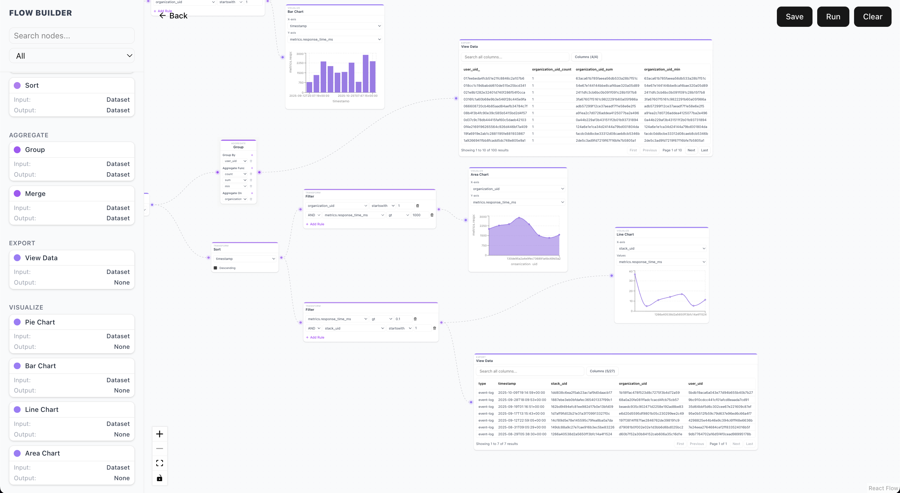

# Dynamatics Backend

Dynamatics is **FlowGraph Analytics Builder**. This repo provides APIs to handles
**flow execution** using a powerful **graph executor** capable of processing arbitrary
flows with multiple inputs and outputs. In addition to that, it also has utility
APIs for **dashboard and flow related operations**

> The executor uses **topological sorting** to ensure nodes are executed in the
> correct order and is generic enough to handle **any node type**.




## Features

- **Flow Execution API**: Execute arbitrary flows with multiple nodes, inputs, and outputs.
- **Dashboard API**: Fetch aggregated data for frontend visualizations.
- **Generic Node Executor**:
  - Handles any type of data transformation or visualization node.
  - Uses topological sorting to respect dependencies between nodes.
  - Supports multiple inputs and outputs per node.

## Tech Stack

- **Backend Framework**: Python (3.12.7) + FastAPI
- **Data Processing / Execution**: Pandas
- **Database**: MongoDB

## Installation

1. Clone the repository

```bash
git clone https://github.com/your-org/dynamatics-backend.git
cd dynamatics-backend
```

2. Setup virtualenv and install dependencies (this project uses [https://docs.astral.sh/uv/](uv))

```bash
uv venv .
source .venv/bin/activate

uv sync
```

3. Run locally

```bash
uvicorn main:app --reload --host 0.0.0.0 --port 8000
```

Server should now be running at http://localhost:8000

## Available Nodes

### Data Transformation Nodes

| Node     | Description                         |
| -------- | ----------------------------------- |
| Filter   | Filter rows based on conditions     |
| Sort     | Sort rows ascending/descending      |
| Merge    | Combine data from multiple nodes    |
| Group By | Group data and calculate aggregates |

### Visualization Nodes

| Node       | Description                                                         |
| ---------- | ------------------------------------------------------------------- |
| Bar Chart  | Render bar charts                                                   |
| Line Chart | Render trends over time                                             |
| Pie Chart  | Show proportion of categories                                       |
| Data Table | Tabular data view with search, pagination and column toggle support |
